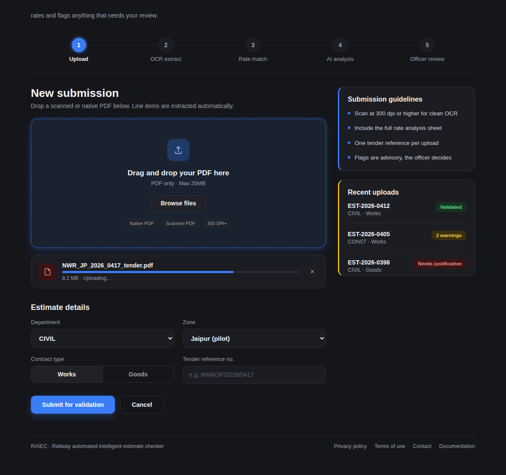
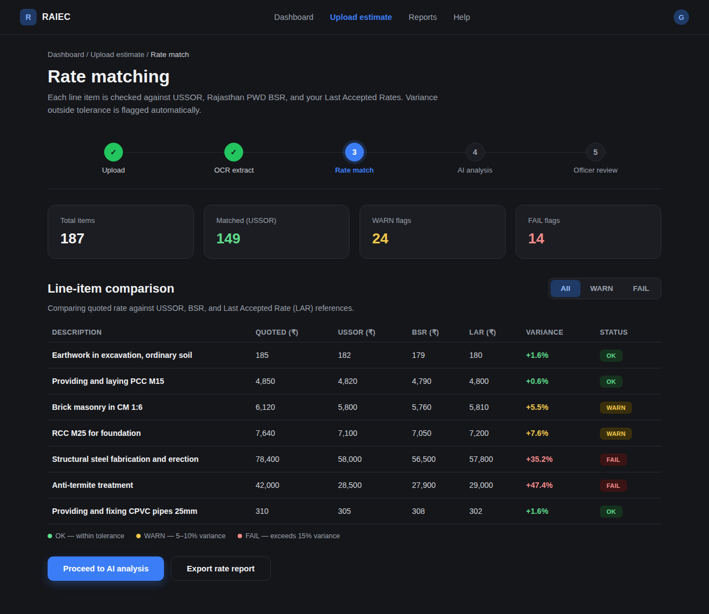
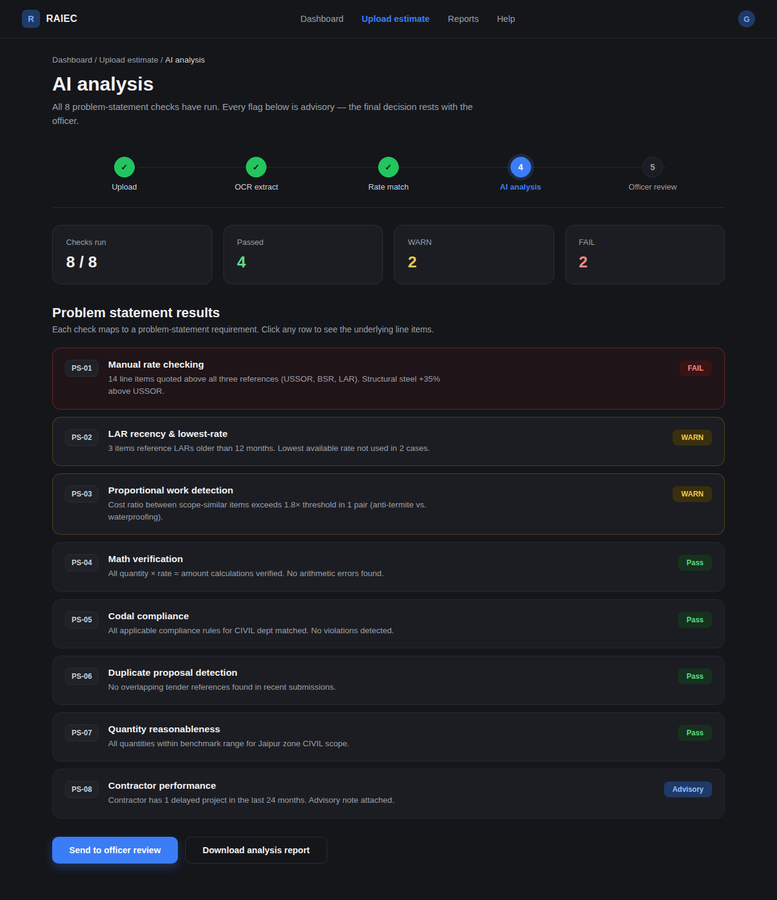
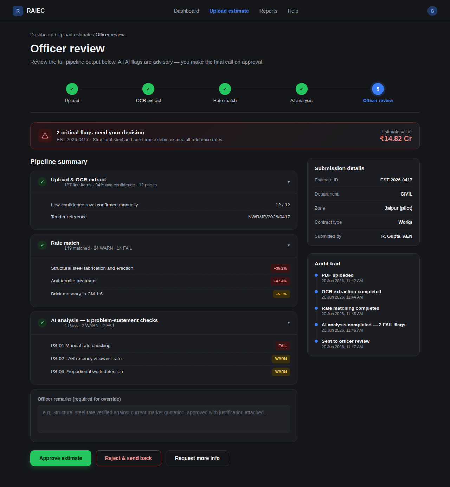

# RAIEC — Railway Automated Intelligent Estimate Checker

An internal tool for **North Western Railway's Civil & Construction unit** that vets construction
tender estimates. It ingests IREPS tender PDFs, extracts every line item, rate-matches them against
official rate references and past accepted rates, runs automated analysis checks, and supports an
officer approve/reject workflow that continuously grows its own rate dataset.

> Built as a B.Tech internship project. Smarter analysis, stronger decisions.

---

## What it does

1. **Upload** an IREPS tender estimate PDF (native or scanned-text).
2. **Extract & structure** — schedules (A/B/C/D), line items, rate breakups and Non-Scheduled (NS) items are parsed automatically.
3. **Rate-match** every item against its reference:
   - **CPWD DSR** and **IRUSSOR** by item code, with a **fuzzy (trigram) description fallback**.
   - **NS items** against the **LAR** (Last Accepted Rate) dataset.
4. **Variance & verdict** — directional thresholds: at/below reference is fine; only over-quoting is flagged → **OK / WARN (5–10% over) / FAIL (>10% over)**.
5. **AI analysis** — rule-based problem-statement checks (rate deviation, LAR lowest-rate, math verification, duplicate detection) **plus an LLM-written risk assessment** (with a rule-based fallback when no model key is set).
6. **Officer review** — approve or reject. On approval, accepted NS rates flow into the LAR dataset (keeping the lowest rate per item), so the system gets more accurate over time.

---

## Screenshots

| Upload & OCR | Rate match |
|---|---|
|  |  |

| AI analysis | Officer review |
|---|---|
|  |  |

---

## Key features

- **PDF parsing** of multiple real IREPS tender layouts (Apache PDFBox).
- **Rate-matching engine**: item-code match → fuzzy description fallback (trigram similarity) → LAR for NS items; directional variance scoring.
- **AI layer**: rule-based checks + optional LLM assessment (OpenAI-compatible — OpenAI / Groq / OpenRouter).
- **Officer workflow** that grows the LAR dataset on approval (lowest-rate-wins).
- **JWT authentication** with **Admin** and **Officer** roles.
- **Dashboard** with live stats, search/filter, CSV export, and a donut/KPI overview.
- **LAR Intelligence** page with real insights computed from the dataset.
- **Bulk ingest** to seed the system from a folder of PDFs in one shot.
- **Animated "How it works" guide** page.

---

## Tech stack

**Backend** — Java 21, Spring Boot 4, Spring Security (JWT), Spring Data JPA / Hibernate, PostgreSQL, Apache PDFBox, Maven (wrapper included).
**Frontend** — vanilla HTML / CSS / JavaScript (no build step), Canvas + CSS animations.
**Testing** — JUnit 5, MockMvc, H2 (isolated test DB).

---

## Architecture (backend modules)

```
com.raiec
├── tender      # PDF parsing, ingest, dashboard, approve/reject, bulk ingest
├── reference   # IRUSSOR & DSR rate-book import + storage
├── lar         # Last Accepted Rate dataset
├── ratematch   # rate-match engine (code + fuzzy) and directional variance
├── ai          # rule-based checks + LLM assessment
├── auth        # users, JWT, login, role-based security
└── common.web  # security config, CORS, error handling
```

---

## Quick start

See **[SETUP.md](SETUP.md)** for full instructions. In short:

```bash
# 1. Create a PostgreSQL database named "raiec"
# 2. Start the backend (Windows PowerShell):
cd backend
$env:JAVA_HOME='C:\Program Files\Java\jdk-21.0.10'   # your JDK 21 path
$env:DB_PASSWORD='your_postgres_password'
.\mvnw.cmd spring-boot:run
# 3. Open index.html in a browser and log in
```

**Default logins** (auto-created on first run): `admin / admin@123` (Admin), `officer / officer@123` (Officer).
Change these and set `RAIEC_JWT_SECRET` before any real deployment.

**Optional:** load the DSR/IRUSSOR rate books for full rate comparison, and set `RAIEC_LLM_API_KEY`
to enable the real LLM assessment — both are covered in SETUP.md.

---

## Status & roadmap

- [x] PDF ingestion & structured parsing
- [x] Rate-matching engine (code + fuzzy) with directional variance
- [x] LAR dataset + officer approval workflow
- [x] Rule-based AI checks + LLM assessment layer
- [x] JWT authentication (Admin / Officer)
- [x] Dashboard, LAR intelligence, guide pages
- [x] Bulk ingest for seeding
- [ ] Cloud deployment (live demo link)

---

*Internal estimate-vetting tool · North Western Railway — Civil & Construction.*
