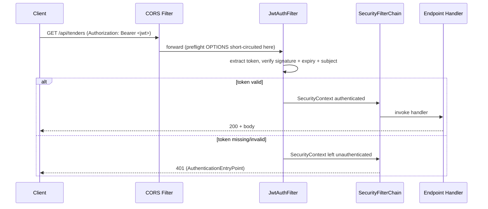
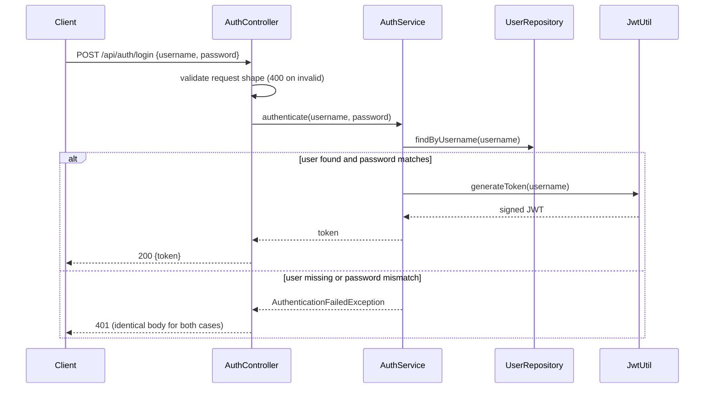
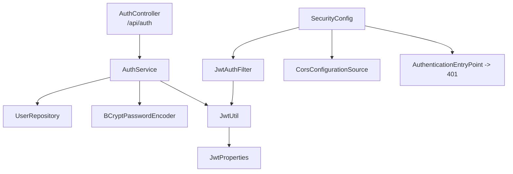

# Design Document

## Overview

This feature introduces stateless JWT bearer authentication to the RAIEC backend using Spring Security and the JJWT library. Today every `/api/**` endpoint is publicly reachable; after this change all endpoints require a valid `Bearer` token except the new login endpoint (`POST /api/auth/login`).

The design follows the established project conventions:

- Package layout `com.raiec.<module>.{entity,repository,service,web}` — a new `com.raiec.auth` module, plus a `com.raiec.security` package for the cross-cutting Spring Security wiring.
- Constructor injection (no field injection), Lombok for entity/DTO boilerplate.
- JPA with `spring.jpa.hibernate.ddl-auto=update` (no Flyway), so the new `users` table is created from the entity at startup.
- Centralized error translation via the existing `ApiExceptionHandler` (`@RestControllerAdvice`).

Scope is intentionally minimal. The system issues and validates tokens, stores BCrypt-hashed passwords, and keeps a `role` field on the user record reserved for future use. Per-endpoint role enforcement is explicitly out of scope. The permissive development CORS configuration must keep working.

### Research Notes

- **JJWT library (`io.jsonwebtoken`)**: The current maintained artifacts are `jjwt-api`, `jjwt-impl` (runtime), and `jjwt-jackson` (runtime, JSON serialization). Modern JJWT (0.11+/0.12+) requires HMAC-SHA keys built via `Keys.hmacShaKeyFor(byte[])`, and the key material for `HS256` must be at least 256 bits (32 bytes) or the library throws `WeakKeyException`. This directly informs Requirement 1.4 (secret length validation). Sources: [JJWT README](https://github.com/jwtk/jjwt), [RFC 7518 §3.2 HMAC key length](https://www.rfc-editor.org/rfc/rfc7518#section-3.2).
- **Spring Security 6 (Spring Boot 4.x)**: The filter-chain is configured with a `SecurityFilterChain` bean. Stateless policy is set via `SessionCreationPolicy.STATELESS`. A custom `OncePerRequestFilter` is registered before `UsernamePasswordAuthenticationFilter` to translate a bearer token into an `Authentication` in the `SecurityContext`. Unauthenticated access to protected routes is rejected by an `AuthenticationEntryPoint` returning 401. Source: [Spring Security reference — Architecture](https://docs.spring.io/spring-security/reference/servlet/architecture.html).
- **CORS ordering**: Spring Security must own CORS in the filter chain (`http.cors(...)`) so that preflight `OPTIONS` requests are handled before authentication. Because the existing `WebConfig` registers CORS via `WebMvcConfigurer`, the security config will reuse a shared `CorsConfigurationSource` so both MVC and the security chain agree on allowed origins/methods/headers. Source: [Spring Security reference — CORS](https://docs.spring.io/spring-security/reference/servlet/integrations/cors.html).
- **BCrypt**: `BCryptPasswordEncoder` (Spring Security crypto) hashes and verifies passwords. BCrypt truncates input beyond 72 bytes, which is why Requirement 4.6 caps the password length at 72.

## Architecture

### Request flow (protected endpoint)



### Login flow



### Component map



### Packages

| Package | Responsibility |
|---|---|
| `com.raiec.auth.entity` | `User` JPA entity |
| `com.raiec.auth.repository` | `UserRepository` |
| `com.raiec.auth.service` | `AuthService`, domain exceptions |
| `com.raiec.auth.web` | `AuthController`, request/response DTOs |
| `com.raiec.security` | `JwtUtil`, `JwtProperties`, `JwtAuthFilter`, `SecurityConfig`, `CorsConfigurationSource` bean |

## Components and Interfaces

### JwtProperties (configuration binding)

Binds the externalized signing secret and validity duration, and validates them at startup.

```java
@ConfigurationProperties(prefix = "raiec.jwt")
@Validated
public record JwtProperties(
    @NotBlank String secret,        // R1.5: required/non-empty
    @Positive long expirationMs     // R1.3, R1.6: positive milliseconds
) {}
```

- Bound from `raiec.jwt.secret` and `raiec.jwt.expiration-ms`.
- `@NotBlank` / `@Positive` cause startup failure when absent/empty/non-positive (R1.5, R1.6).
- Secret byte-length (>= 32 bytes) is enforced where the signing key is built in `JwtUtil` (R1.4); a too-short secret throws on key construction and the application context fails to start.

### JwtUtil

Creates and validates signed tokens. Holds the `SecretKey` derived from the configured secret.

```java
@Component
public class JwtUtil {
    JwtUtil(JwtProperties props);                 // builds SecretKey via Keys.hmacShaKeyFor; throws if < 256 bits (R1.4)
    String generateToken(String username);        // subject = username, exp = now + expirationMs (R4.2, R4.3)
    Optional<String> validateAndGetSubject(String token); // present iff signature ok, not expired, non-empty subject (R6.2-6.6)
}
```

- `generateToken` sets `subject`, `issuedAt`, and `expiration = now + expirationMs`, signs with `HS256`.
- `validateAndGetSubject` parses the token with the signing key. It returns the subject only when the signature verifies, `expiration` is strictly after now, and the subject is non-empty; otherwise it returns `Optional.empty()` (no exception leaks to the filter).

### JwtAuthFilter (`OncePerRequestFilter`)

Extracts and validates the bearer token on each request, sets the security context, and always continues the chain.

```java
public class JwtAuthFilter extends OncePerRequestFilter {
    JwtAuthFilter(JwtUtil jwtUtil);
    protected void doFilterInternal(req, res, chain);
}
```

Behavior:
- Reads the `Authorization` header. Only a value beginning with the case-sensitive prefix `Bearer ` followed by a non-empty token is processed (R6.1, R6.5).
- Delegates to `JwtUtil.validateAndGetSubject`. On success, builds a `UsernamePasswordAuthenticationToken` with the subject as principal (no authorities in this phase) and places it in the `SecurityContext` (R6.2).
- On any failure (bad signature, expired, unparseable, missing/empty subject, no/!`Bearer ` header), it leaves the context unauthenticated and continues the chain (R6.3–R6.6). Authorization rejection (401) is handled downstream by `SecurityConfig`.

### SecurityConfig

Defines the filter chain, authorization rules, stateless session policy, CORS, and the 401 entry point.

```java
@Configuration
@EnableWebSecurity
public class SecurityConfig {
    SecurityFilterChain filterChain(HttpSecurity http, JwtAuthFilter jwtAuthFilter, CorsConfigurationSource cors);
    CorsConfigurationSource corsConfigurationSource();   // shared with WebConfig
    AuthenticationEntryPoint restAuthEntryPoint();        // 401 JSON, no redirect
    PasswordEncoder passwordEncoder();                    // BCryptPasswordEncoder
}
```

Filter chain rules:
- `http.cors(...)` using the shared `CorsConfigurationSource`, processed before authentication (R8.1, R8.2).
- `csrf` disabled (stateless API).
- `authorizeHttpRequests`: permit `POST /api/auth/login` and `OPTIONS /api/**`; everything else under `/api/**` requires authentication (R7.1–R7.3, R8.2).
- `sessionManagement` → `STATELESS` (R7.4).
- `addFilterBefore(jwtAuthFilter, UsernamePasswordAuthenticationFilter.class)`.
- `exceptionHandling().authenticationEntryPoint(restAuthEntryPoint())` → 401 for unauthenticated protected requests (R7.2).

CORS reuse: the existing `WebConfig` is refactored to delegate to the same `CorsConfigurationSource` bean (allowed origin patterns `*`, methods `GET/POST/PUT/DELETE/OPTIONS`, all headers) so MVC and security agree (R8.1, R8.3, R8.4).

### AuthService

```java
@Service
public class AuthService {
    AuthService(UserRepository users, PasswordEncoder encoder, JwtUtil jwtUtil);
    String authenticate(String username, String password);   // returns JWT or throws AuthenticationFailedException
    User createUser(String username, String rawPassword, String role); // hashes password (R3.1, R3.4)
}
```

- `authenticate`: loads the user; if absent OR the password does not verify against the stored hash, throws `AuthenticationFailedException` with a generic message (R5.1–R5.3). On success returns `jwtUtil.generateToken(username)` (R4.1).
- `createUser`: encodes the raw password with BCrypt, persists the user; if hashing fails, no record is persisted and the error propagates (R3.1, R3.3, R3.4). (Provided for seeding/admin use; no public registration endpoint in this phase.)

### AuthController (`/api/auth`)

```java
@RestController
@RequestMapping("/api/auth")
public class AuthController {
    @PostMapping("/login")
    ResponseEntity<LoginResponse> login(@Valid @RequestBody LoginRequest request);
}
```

- `LoginRequest` is bean-validated. Blank/whitespace-only username or password, username > 255 chars, or password > 72 chars → 400 before any credential check (R4.5, R4.6).
- On success returns 200 with `LoginResponse` containing the token (R4.4).
- `AuthenticationFailedException` is mapped to 401 with an identical generic body for unknown-user and bad-password cases (R5.1–R5.3) via `ApiExceptionHandler`.

### DTOs

```java
public record LoginRequest(
    @NotBlank @Size(max = 255) String username,
    @NotBlank @Size(max = 72) String password) {}

public record LoginResponse(String token) {}
```

## Data Models

### User entity (`com.raiec.auth.entity.User`)

| Field | Column | Type / Constraints | Requirement |
|---|---|---|---|
| `id` | `id` | `Long`, identity PK | — |
| `username` | `username` | `varchar(255)`, `unique`, `not null`, non-blank | R2.1 |
| `password` | `password` | `text`/`varchar`, `not null` — BCrypt hash | R2.2, R2.3, R3.x |
| `role` | `role` | `varchar`, `not null` | R2.3 |

```java
@Entity
@Table(name = "users", uniqueConstraints = @UniqueConstraint(columnNames = "username"))
@Getter @Setter @NoArgsConstructor @AllArgsConstructor @Builder
public class User {
    @Id @GeneratedValue(strategy = GenerationType.IDENTITY)
    private Long id;

    @Column(name = "username", nullable = false, unique = true, length = 255)
    private String username;

    @Column(name = "password", nullable = false)
    private String password;   // BCrypt hash only

    @Column(name = "role", nullable = false, length = 32)
    private String role;
}
```

The unique constraint on `username` enforces R2.6 (duplicate insert rejected; the resulting `DataIntegrityViolationException` rolls back so no new record persists).

### UserRepository

```java
public interface UserRepository extends JpaRepository<User, Long> {
    Optional<User> findByUsername(String username);   // R2.4 (one match) / R2.5 (empty)
}
```

### Configuration properties

```properties
# application.properties (values externalized; dev fallback only)
raiec.jwt.secret=${JWT_SECRET:}            # required, >= 32 bytes (R1.2, R1.4, R1.5)
raiec.jwt.expiration-ms=${JWT_EXPIRATION_MS:3600000}  # positive ms (R1.3, R1.6)
```

The Maven build adds `jjwt-api` (compile), `jjwt-impl` and `jjwt-jackson` (runtime), plus `spring-boot-starter-security` (R1.1).

## Correctness Properties

*A property is a characteristic or behavior that should hold true across all valid executions of a system — essentially, a formal statement about what the system should do. Properties serve as the bridge between human-readable specifications and machine-verifiable correctness guarantees.*

The properties below are derived from the prework analysis. Configuration/startup checks (R1.1–R1.6), schema constraints (R2.1, R2.6), the hashing-failure path (R3.4), and endpoint/CORS wiring (R4.4, R7.x, R8.x) are validated with example, edge-case, integration, or smoke tests rather than property-based tests (see Testing Strategy).

### Property 1: Repository behaves like a username-keyed map

*For any* set of persisted users with distinct usernames, `findByUsername(u)` returns the single user whose username exactly equals `u`, and returns empty for any username not present in the store.

**Validates: Requirements 2.4, 2.5**

### Property 2: Passwords are stored only as BCrypt hashes

*For any* valid plaintext password, the value stored on the created `User` is a BCrypt hash that is not equal to the plaintext password.

**Validates: Requirements 3.1, 3.3, 2.2**

### Property 3: Password verification accepts the matching password

*For any* valid plaintext password `p`, verifying `p` against the stored BCrypt hash of `p` returns a successful result (hash/verify round-trip).

**Validates: Requirements 3.2**

### Property 4: Password verification rejects a non-matching password

*For any* two distinct plaintext passwords `p1` and `p2`, verifying `p2` against the stored BCrypt hash of `p1` returns a failed result.

**Validates: Requirements 3.5**

### Property 5: Valid credentials yield a verifiable token for that user

*For any* user created with username `u` and password `p`, authenticating with `u` and `p` returns a signed JWT that validates against the signing secret and whose subject equals `u`.

**Validates: Requirements 4.1**

### Property 6: JWT generation/validation round-trip preserves subject and sets expiry

*For any* non-empty username `u`, validating the token produced by `generateToken(u)` returns `u` as the subject, and the token's expiration equals its issue time plus the configured validity duration (the token is valid at issue time).

**Validates: Requirements 4.2, 4.3**

### Property 7: Blank credential fields are rejected before verification

*For any* login request whose username or password is empty or whitespace-only, the controller responds with HTTP 400 and performs no credential verification.

**Validates: Requirements 4.5**

### Property 8: Over-length credential fields are rejected

*For any* login request whose username exceeds 255 characters or whose password exceeds 72 characters, the controller responds with HTTP 400.

**Validates: Requirements 4.6**

### Property 9: Authentication failures return a uniform, non-disclosing 401

*For any* login attempt that fails because the username is unknown or because the password does not match, the controller responds with HTTP 401, a body that contains no JWT, and a body that is identical across both failure classes (it does not disclose which field was incorrect).

**Validates: Requirements 5.1, 5.2, 5.3**

### Property 10: A valid bearer token authenticates the request context

*For any* non-empty username `u`, a request carrying `Authorization: Bearer <token>` where `<token>` is a freshly issued valid token for `u` causes the filter to establish an authenticated security context whose principal equals `u`, and to continue the filter chain.

**Validates: Requirements 6.1, 6.2**

### Property 11: Invalid tokens leave the context unauthenticated

*For any* token that has an invalid signature, an expiration at or before the current time, is unparseable, or has a missing/empty subject, the filter leaves the security context unauthenticated and continues the filter chain.

**Validates: Requirements 6.3, 6.4, 6.6**

### Property 12: Missing or malformed Authorization headers leave the context unauthenticated

*For any* request whose `Authorization` header is absent, does not begin with the case-sensitive prefix `Bearer `, or has the `Bearer ` prefix followed by an empty token value, the filter leaves the security context unauthenticated and continues the filter chain.

**Validates: Requirements 6.5**

## Error Handling

Error translation follows the existing `ApiExceptionHandler` (`@RestControllerAdvice`) and its `ApiError(timestamp, status, error, message)` JSON shape, extended with new exception mappings:

| Condition | Mechanism | HTTP status | Notes |
|---|---|---|---|
| Blank/over-length login fields (R4.5, R4.6) | Bean Validation on `LoginRequest` → `MethodArgumentNotValidException` | 400 | Handled by a new `@ExceptionHandler(MethodArgumentNotValidException.class)`; no service call occurs. |
| Unknown username / wrong password (R5.1–R5.3) | `AuthenticationFailedException` from `AuthService` | 401 | Single generic message (e.g. `"Invalid username or password"`); identical body for both cases — no disclosure. |
| Unauthenticated protected request (R7.2) | `AuthenticationEntryPoint` in `SecurityConfig` | 401 | Produces the same `ApiError` JSON shape; never invokes the handler. |
| Hashing failure during user creation (R3.4) | Exception from `PasswordEncoder` propagates; `@Transactional` rolls back | 500 | No `User` record persisted. |
| Duplicate username (R2.6) | `DataIntegrityViolationException` on unique constraint; transaction rolls back | 409 | No new record persisted. |
| Startup misconfiguration (R1.4–R1.6) | `@Validated` `JwtProperties` + key-length check in `JwtUtil` | n/a (fail fast) | Application context fails to start with a descriptive message. |

Token validation failures inside `JwtAuthFilter` are **not** surfaced as errors: per R6.3–R6.6 the filter swallows parsing/verification exceptions, leaves the context unauthenticated, and continues the chain. The downstream authorization layer then returns 401 for protected routes.

## Testing Strategy

### Dual approach

- **Property-based tests** verify the universal properties above across many generated inputs.
- **Example, edge-case, integration, and smoke tests** cover startup configuration, schema constraints, controller wiring, and CORS behavior that do not benefit from randomized inputs.

### Property-based testing

PBT **is appropriate** for this feature: `JwtUtil` (token generation/validation), the `BCryptPasswordEncoder` round-trips, the repository lookup semantics, and the request-validation/filter logic are pure-ish, input-driven behaviors with large input spaces (arbitrary usernames, passwords, token strings, expiry times).

- **Library**: [jqwik](https://jqwik.net/) — the standard JUnit 5 property-based testing library for Java. Do not implement property generation from scratch.
- **Iterations**: each property test runs a minimum of 100 generated cases (`@Property(tries = 100)` or higher).
- **Tagging**: each property test is annotated with a comment referencing its design property, in the format:
  `// Feature: jwt-authentication, Property {number}: {property_text}`
- **Generators**:
  - Valid usernames: non-blank strings up to 255 chars.
  - Valid passwords: non-blank strings up to 72 bytes (BCrypt's effective limit).
  - Blank inputs: empty and whitespace-only strings (for Property 7).
  - Over-length inputs: strings longer than 255 / 72 chars (for Property 8).
  - Tampered/foreign-key tokens and random non-JWT strings (for Properties 11, 12).
- **Mapping**: Properties 1–12 each map to a single jqwik property test. Service/filter logic is tested with an in-memory store or mocks (no live PostgreSQL); repository lookup (Property 1) uses `@DataJpaTest` with the H2 test profile already configured in `src/test/resources/application.properties`.

### Example / edge-case tests

- **Startup config (R1.4–R1.6, smoke/edge)**: `@SpringBootTest` variants asserting the context fails to start for a too-short secret, an empty secret, and a non-positive validity duration, each with the expected error; and starts for valid values.
- **Schema (R2.1, R2.6, edge)**: `@DataJpaTest` — unique-constraint violation on duplicate username (count unchanged), and rejection of blank/over-length usernames.
- **Hashing failure (R3.4, example)**: mock `PasswordEncoder` that throws → `createUser` propagates and persists nothing.
- **Controller success (R4.4, example)**: MockMvc — valid login returns 200 with the token in the body.

### Integration / smoke tests (MockMvc, `@SpringBootTest`)

- **Endpoint authorization (R7.1–R7.4)**: login reachable with/without an `Authorization` header; unauthenticated `GET /api/lar` (and similar) returns 401 and the handler is not invoked; a valid token reaches the handler; responses create no HTTP session and retain no context between requests.
- **CORS continuity (R8.1–R8.4)**: preflight `OPTIONS /api/**` succeeds without a token; an allowed-origin/allowed-method request includes `Access-Control-Allow-*` headers; a disallowed origin/method omits them.
- **Dependency/config smoke (R1.1–R1.3)**: context loads with JJWT and Spring Security on the classpath and `JwtProperties` bound from configuration.
